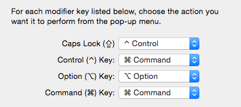
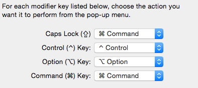
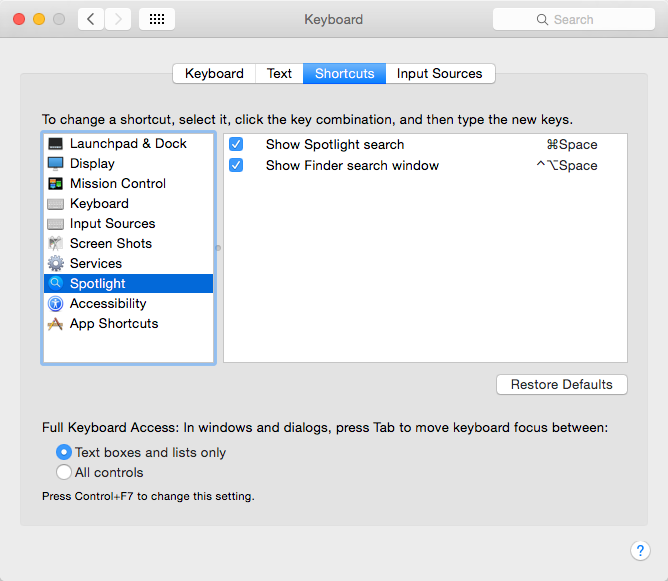
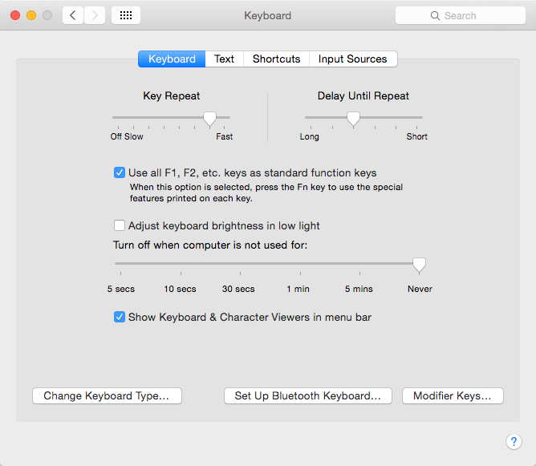

# Karabiner-setting
Karabiner の設定をエクスポートしたもの。

## エクスポート方法
設定メニューからできるものと思ってたけど見当たらなくて、調べたらコマンドを叩くみたい。

- [](http://qiita.com/icb54615/items/9c7a5366e23496bfacd5)[Karabinerの設定移行 - Qiita](http://qiita.com/icb54615/items/9c7a5366e23496bfacd5)[](http://b.hatena.ne.jp/entry/http://qiita.com/icb54615/items/9c7a5366e23496bfacd5)


```
/Applications/Karabiner.app/Contents/Library/bin/karabiner export
```

とするとシェルスクリプトが出力されるので、これをリダイレクトして保存したものをこのリポジトリに置いとく。スクリプトを実行すればインポートされる。

## 設定内容
US配列の Built-in keyboard, Magic Keyboard 2 を使用。OS の System Preference で <kbd>Caps Lock</kbd> を <kbd>Control</kbd> にしてる。以下を Karabiner で設定。

- <kbd>左Command</kbd> を <kbd>英数</kbd> に 
- <kbd>右Command</kbd> を <kbd>かな</kbd> に 
- <kbd>fn</kbd> を <kbd>Command</kbd> に 
- <kbd>右Option</kbd> を <kbd>fn</kbd> に 
- <kbd>Control</kbd> + <kbd>P</kbd><kbd>N</kbd><kbd>B</kbd><kbd>F</kbd> でカーソル移動 (Emacs mode)
- 円記号をバックスラッシュに
- JIS Keyboard を US keyboard として使う

## Karabiner 以外の設定
以下の設定は Karabiner とは関係ないけどついでに記録しとく。

### System Preference の Modifier Key の設定
#### US keyboard case



#### JIS keyboard case



### Spotlight を <kbd>Cmd</kbd> + <kbd>Space</kbd> に

 

### <kbd>F1</kbd>, <kbd>F2</kbd> とかはそのままで使う
ディスプレイ輝度、音量の変更などは <kbd>Fn</kbd> を押しながら行う。



## その他
(Yosemite で Magic Keyboard2 を使ってるからか、そもそも <kbd>Fn</kbd> が動作してない...)

